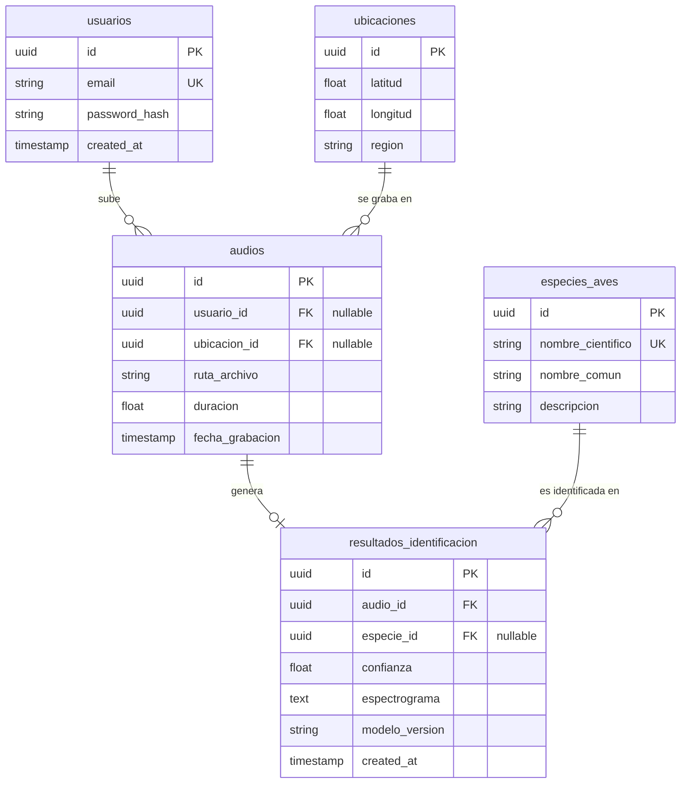

# Diagrama ER - BioSonIA (PostgreSQL + TypeORM)

Este es el diseño relacional para las tablas requeridas.

```mermaid
erDiagram
    usuarios ||--o{ audios : "sube"
    ubicaciones ||--o{ audios : "se graba en"
    audios ||--o| resultados_identificacion : "genera"
    especies_aves ||--o{ resultados_identificacion : "es identificada en"

    usuarios {
        uuid id PK
        string email UK
        string password_hash
        timestamp created_at
    }

    especies_aves {
        uuid id PK
        string nombre_cientifico UK
        string nombre_comun
        string descripcion
    }

    ubicaciones {
        uuid id PK
        float latitud
        float longitud
        string region
    }

    audios {
        uuid id PK
        uuid usuario_id FK "nullable"
        uuid ubicacion_id FK "nullable"
        string ruta_archivo
        float duracion
        timestamp fecha_grabacion
    }

    resultados_identificacion {
        uuid id PK
        uuid audio_id FK
        uuid especie_id FK "nullable"
        float confianza
        text espectrograma
        string modelo_version
        timestamp created_at
    }
```
